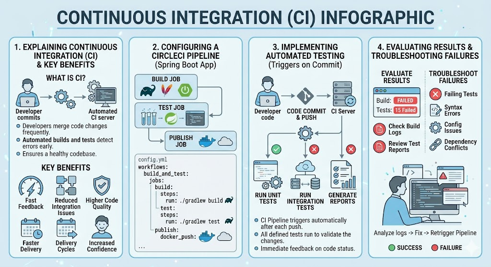

# [4.7] Continuous Integration with CircleCI

## Lesson Overview

## Dependencies
- [Self Studies](./studies.md)
- [Lesson](./lesson.md)
- [Assignment](./assignment.md)

## Lesson Objectives
* **Explain** what Continuous Integration is and identify its key benefits in modern software development teams
* **Configure** a CircleCI pipeline with build, test, and publish jobs for a Spring Boot application
* **Implement** automated testing in a CI pipeline that triggers on every code commit
* **Evaluate** CI pipeline results and troubleshoot common build failures

## Lesson Plan

| Duration | What | How or Why |
|----------|------|------------|
| 10 min | Warm up | Intro and lesson overview, verify prerequisites |
| 20 min | Part 1: Understanding Continuous Integration | What is CI, why it's needed, benefits, CI workflow, pipeline components |
| 10 min | Activity 1 — CI in the real world | Group discussion on integration problems, broken builds, and team benefits |
| 20 min | Part 2: Prepare DevOps demo project for CI | Remove Docker Compose and database dependencies, simplify pom.xml and application.properties |
| 20 min | Part 3: Add a test for your controller | Create DemoControllerTest.java, run test locally, verify Dockerfile |
| 15 min | Part 4: Push project to GitHub | Create personal GitHub repo, initialise Git, commit and push code |
| 40 min | Part 5: Build the CI pipeline configuration | Create .circleci/config.yml — build, test, and publish jobs with workflow |
| 10 min | Activity 2 — Read the pipeline configuration | Learners interpret the config.yml and answer questions |
| 10 min | Part 6: Push configuration to GitHub | Commit and push config.yml, trigger first pipeline run |
| 10 min | Part 7: Setting up CircleCI | Create CircleCI account, connect GitHub repo, start first build |
| 10 min | Part 8: Set up Docker Hub credentials | Add DOCKER_USERNAME and DOCKER_PASSWORD as environment variables in CircleCI |
| 20 min | Part 9: Watch pipeline run + Activity 3 | Trigger pipeline, watch all three jobs, verify Docker Hub, end-to-end test |
| 10 min | Recap and wrap up | Key takeaways, troubleshooting tips, Q&A |
| **Total** | | **175 min — allows ~5 min buffer** |